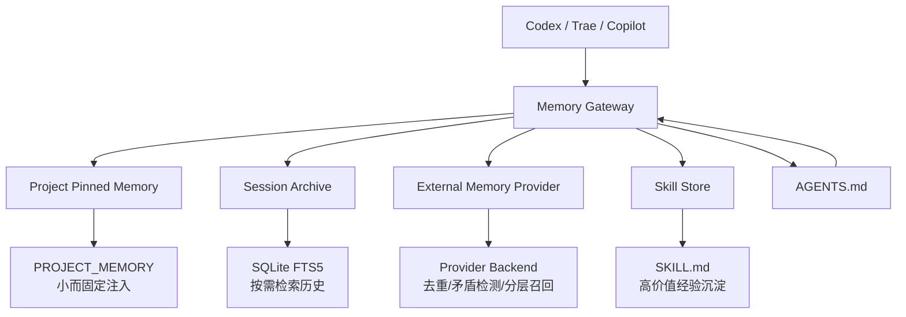

# 结论

我同意你的方向：**这件事不应该再从零发明一套“理想记忆架构”**，而应该直接以 **Hermes Agent 的记忆体系**为母版，再做一层适合你场景的裁剪。更准确地说：

* **要借鉴的不是 Hermes 当前“平铺文件版”的全部细节**，而是它已经成型的 **三层思路**：

  1. **小而固定注入的“常驻记忆”**，
  2. **按需检索的历史会话存档**，
  3. **可插拔的外部 memory provider**，再加上 **skills 自演化闭环**。Hermes 官方 README 和文档都明确把这几部分放在一起：bounded memory、FTS5 session search、memory providers、skill creation/improvement。([GitHub][1])

* 但也必须说清楚：**Hermes 当前内建 memory 并没有真正解决“记忆污染”**。这不是我主观担忧，而是 Hermes 自己的 issue 直接承认：当前 `MEMORY.md / USER.md` 是扁平读写，没有 contradiction detection、没有 confidence-aware retrieval、没有 forgetting mechanism；同一个事实前后冲突时会长期共存，直到 agent 手工发现。([GitHub][2])

所以，**正确落法不是“原样照抄 Hermes 当前内建 memory”**，而是：

> **沿用 Hermes 的总架构，直接跳过它现在最弱的 flat-file 内核，优先吸收它已经验证有效的分层策略，再把“污染控制”借给更强的 provider 机制。**

---

# 先把 Hermes 记忆体系拆清楚

## 1）Hermes 当前实际在跑的记忆分层

Hermes 当前有两层原生记忆，再外挂一层 provider：

### A. 常驻记忆：`MEMORY.md` + `USER.md`

这是 **bounded curated memory**，每次会话启动时会注入 system prompt。默认限制是：

* `MEMORY.md`：2200 字符，约 800 tokens
* `USER.md`：1375 字符，约 500 tokens

官方文档和示例配置都写得很明确。([GitHub][3])

### B. 历史会话检索：`session_search`

Hermes 把所有 CLI 和消息平台 session 存进 SQLite（`~/.hermes/state.db`），并用 **FTS5 全文检索**；它把这层定位成“无限历史”，与常驻记忆互补：
常驻记忆负责“总要带进 prompt 的关键事实”，session search 负责“按需回想过去聊过什么”。([Hermes Agent][4])

### C. 外部 memory provider

Hermes 还支持 8 个 external memory provider。provider 启用后，Hermes 会自动：

1. 把 provider 上下文注入 prompt
2. 每轮前后台预取相关记忆
3. 每轮后同步对话
4. 会话结束时做提取
5. 把 built-in memory 的写入镜像给 provider
6. 注册 provider 专属工具

这套接入链路已经是比较成熟的 memory plugin 架构了。([Hermes Agent][5])

---

## 2）Hermes 为什么能缓解“上下文膨胀”

这部分它确实有可借鉴价值，而且是**已实现**的，不只是口号。

### 已验证有效的点

#### 小而固定的常驻记忆

Hermes 明确限制 `MEMORY.md` / `USER.md` 字符数，目的就是让 system prompt 始终有界。文档甚至给出了容量管理策略：超过上限就要求 consolidate/replace/remove，而不是无上限增长。([GitHub][3])

#### 历史会话不直接常驻

历史会话不是每轮都塞进 prompt，而是走 SQLite FTS5 检索 + 摘要，这就是典型的 **“常驻小记忆 + 按需召回大历史”**。([Hermes Agent][4])

#### Prompt 冻结快照

Hermes 文档明确说，memory 的系统注入是在 **session start** 时冻结的，中途写入虽然会落盘，但不会立刻重写 system prompt，这样可以保持 prefix cache 稳定。([Hermes Agent][4])

### 但它没有“彻底解决”

Hermes 自己也已经出现新的 issue：有人指出 `MEMORY.md`、`USER.md`、`SOUL.md`、daily logs 之类静态核心文件如果继续全部加载，每次调用仍然会造成高 token 成本；这个问题在 2026-04-16 还是 open 的。也就是说，**Hermes 解决的是“核心 memory 有界 + 会话历史按需检索”，但并没有把所有静态上下文源都彻底分层优化掉。** ([GitHub][6])

---

# 你这个场景，该怎么“按 Hermes 思路裁剪”

你已经明确说了：

* 不太关心“使用者是谁”
* 不想做复杂权限
* 只关心 **同一项目在 Codex / Trae / Copilot 之间共享记忆**
* 如果规则冲突，以 `AGENTS.md` 为准

那就意味着：**Hermes 的 USER-centric 部分可以弱化，Project/workspace/container 才是主作用域。**

---

## 建议的裁剪版结构



---

# 我建议你直接继承 Hermes 的 4 个点

## 1）保留“常驻小记忆 + 会话检索”二分法

这是 Hermes 里最成熟、也最值得原样借鉴的部分。
你没必要把所有记忆都做成向量库，MVP 也没必要一开始就上复杂图谱。

### 对你的场景，直接改成：

#### `PROJECT_MEMORY`

替代 Hermes 的 `MEMORY.md`
只存项目级、稳定、可复用的内容，比如：

* 仓库结构
* 构建/测试命令
* 约定俗成的实践
* 已验证的坑点
* 反复复用的解决方法

#### `PROJECT_SESSIONS`

替代 Hermes 的 session archive
所有工具会话都进 SQLite FTS5，按需检索，不常驻

#### `PROJECT_SKILLS`

把高频经验提升成 skill，而不是永远留在 memory 里

这个方向和 Hermes 自己的定位一致：它把 bounded memory、session search、skills 放在一个学习闭环里。([GitHub][1])

---

## 2）把 USER 维度降级为可选，不当核心

Hermes 当前 built-in memory 是 `MEMORY.md + USER.md` 两文件。对你来说，`USER.md` 不是刚需。官方文档里也把它定义为“用户偏好、沟通风格、身份信息”。([Hermes Agent][4])

你这里更应该改成：

* 主作用域：`project_key`
* 可选附加维度：`tool_name`
* 可选附加维度：`account_alias`
* 不再以 `principal/user_id` 做中心

也就是说，**你不需要 Hermes 那种“人”的深度建模，除非后续真要做跨项目个性化。**

---

## 3）保留 provider abstraction，但把它改成“项目容器”

Hermes provider 体系很值得借鉴，因为它已经把 memory backend 抽象成插件了。([Hermes Agent][7])

你这里最适合借用的不是“谁是用户”，而是 **container / workspace / project scope** 这类概念：

* **Supermemory provider** 明确支持 `container_tag`、`custom_containers` 和 multi-container；官方文档甚至给了 `project-alpha` / `shared-knowledge` 的例子。它还支持 `auto_recall`、`auto_capture`、`trivial message filtering` 和 **context fencing**。([Hermes Agent][5])
* **Honcho** 更偏人/peer/workspace 建模，适合 multi-agent user modeling，但你这个阶段其实没必要优先上。([Hermes Agent][5])

所以对你来说，更合理的是：

> **一项目一 container / workspace，而不是一用户一 profile。**

---

## 4）规则冲突时，AGENTS 优先——这点 Hermes 其实也支持你的判断

这不是你拍脑袋定的，是 Hermes 文档本身就已经在做的分离原则。
它在“什么该存 memory、什么不该存”里明确写了：

* trivial/obvious info 不存
* session-specific ephemera 不存
* **已经在 context files 里的内容（SOUL.md、AGENTS.md）不存**

也就是：**AGENTS/SOUL 这种规则文件，不应该再次复制进 memory。** ([Hermes Agent][4])

所以你说的：

> 冲突时以 AGENTS 为准

我赞成，而且这和 Hermes 自己的 memory hygiene 原则是兼容的。([Hermes Agent][4])

---

# 重点：Hermes 是怎么处理“记忆污染”的？

这里必须分成 **已实现** 和 **未实现** 两部分。
你前面批评得对：我之前说的“置信度、过期、降权、人工确认”如果没有证据，就是抽象建议，不算可落地方案。

---

## A. Hermes 当前**已实现**的污染控制

### 1）只允许小而精的常驻记忆

Hermes 明确要求 MEMORY/USER 只保存环境事实、约定、纠正、完成工作、可复用 lesson；而 trivial、raw dumps、临时路径、一次性调试信息都应该跳过。([Hermes Agent][4])

这其实就是**第一道污染闸门**：
不要让“临时上下文”进入 pinned memory。

---

### 2）重复项拒绝

Hermes 文档明确写了：exact duplicate 会被自动拒绝，不会重复添加。([Hermes Agent][4])

这个能力不强，但至少能挡住最粗暴的重复污染。

---

### 3）安全扫描

Hermes 会对 memory entry 做注入与 exfiltration 扫描，命中 prompt injection、credential exfiltration、SSH backdoor、不可见 Unicode 等威胁模式会被拦下。([Hermes Agent][4])

这个更多是安全污染，不是语义污染，但在多工具共享场景里也很关键。

---

### 4）容量压力下的 consolidate

当 memory 快满时，Hermes 的规范是：
先看现有条目，找能移除/合并的项，再 `replace` 合并成更短更密的版本，然后再新增。文档还建议在 80% 以上容量时主动 consolidate。([Hermes Agent][4])

这能控制膨胀，但**不能自动判断“哪条更真”**。

---

## B. Hermes 当前**没有真正解决**的污染问题

这是你最关心的，也是结论最关键的部分。

### 1）没有矛盾检测

Hermes 官方 issue #509 直接写了：
当前系统没有 contradiction detection；“Monday 记 PostgreSQL、Friday 记改成 MySQL”，两条会长期共存。([GitHub][2])

### 2）没有 confidence-aware retrieval

同一个 issue 也明确说了：当前没有 confidence-aware retrieval。也就是说，Hermes built-in memory 不会告诉你“我对这条记忆其实不太确定”。([GitHub][2])

### 3）没有 forgetting mechanism

还是同一个 issue：它没有自动 forgetting mechanism。([GitHub][2])

### 4）flat file 没有重要性、scope、时间戳、类别

Hermes 官方 issue #674 直接说，当前 flat-file memory 没有 importance scoring、没有 scoping、没有 categories、没有 timestamps beyond file mtime。([GitHub][8])

### 5）无法表达关系、衰减、语义搜索

issue #346 也直接写了：当前平面 memory 不能表达关系、不能做 stale decay、不能做 semantic search。([GitHub][9])

---

# 所以，基于 Hermes 的正确判断是：

## **Hermes 内建 memory 适合解决：**

* 上下文膨胀的第一层问题
* 关键项目事实的常驻注入
* 会话历史的按需召回
* skill learning loop 的入口

## **Hermes 内建 memory 不适合单独承担：**

* 多工具共享下的污染治理
* 冲突事实消歧
* 自动降权与过期
* 项目级复杂关系建模

---

# 既然只关心记忆，不关心用户，那我建议你直接借 Hermes 的 provider 来补污染控制

这里我不再给抽象方法，而是只说 **Hermes 文档里已存在、可验证的能力**。

---

## 方案优先级 1：Holographic 风格

这是我认为最适合你现在这个阶段的参考点。

Hermes 文档里，**Holographic provider** 的特点非常直接：

* 本地 SQLite
* FTS5
* **trust scoring**
* `fact_feedback` 工具可打 helpful/unhelpful 反馈
* `contradict` 工具可自动检测 conflicting facts
* `auto_extract` 可选

这已经不是“我建议你做 trust score”，而是 Hermes 生态里已经有一个 provider 在这么干。([Hermes Agent][5])

### 为什么它适合你

因为你当前诉求是：

* 本地/私有更友好
* 不想先做复杂身份体系
* 更关心“污染控制”而不是“人格建模”

Holographic 的 `contradict + trust score + feedback`，正好对准这个点。([Hermes Agent][5])

---

## 方案优先级 2：Supermemory 风格

Hermes 文档里，Supermemory provider 有几条对你特别有用：

* `container_tag`
* `custom_containers`
* `auto_recall`
* `auto_capture`
* `capture_mode`
* `search_mode = hybrid`
* **trivial message filtering**
* **context fencing：把已召回记忆从被捕获的 turn 中剥离，避免递归污染**
* multi-container 模式可显式设置 `project-alpha` / `shared-knowledge`

这一套其实就是你现在要的“项目级共享记忆”雏形。([Hermes Agent][5])

### 为什么它比 Honcho 更贴你

因为你不关心“谁是用户”，而更关心：

* 项目 A 一个 container
* 项目 B 一个 container
* 共享知识一个公共 container
* 避免召回内容再次被回写污染

Supermemory 这几项功能正对这个问题。([Hermes Agent][5])

---

## 方案优先级 3：OpenViking / Mem0 / RetainDB 的可借点

### OpenViking

* tiered retrieval
* 自动抽取 6 类内容（profile, preferences, entities, events, cases, patterns）

更适合“分层加载”和结构化抽取。([Hermes Agent][5])

### Mem0

* server-side LLM fact extraction
* reranking
* **automatic deduplication**

更适合“自动抽取 + 自动去重”。([Hermes Agent][5])

### RetainDB

* hybrid search
* 7 memory types
* delta compression
* remember 时带 type + importance

更适合 typed memory。([Hermes Agent][5])

---

# 反过来说，什么不该直接照搬 Hermes

## 1）不要照搬 flat-file 作为最终形态

Hermes 自己都已经在 issue #674 里准备把 flat file 迁到 SQLite with scope / importance / timestamps 了。也就是说，**就连 Hermes 自己也知道 flat-file 只是当前实现，不是最终理想形态。** ([GitHub][8])

所以你如果现在做自己的系统，应该直接采用：

* `PROJECT_MEMORY` 逻辑层保留 Hermes 风格
* 但底层存储直接用 SQLite / structured rows
* 对外仍然可以渲染成 Markdown 或 compact text

---

## 2）不要照搬 Hermes 的 session JSON 文件积累方式

Hermes 已经有 open issue 指出：session JSON 文件不会删除，导致磁盘增长和 token 成本失控。([GitHub][10])

所以如果你提取 Hermes 的 session search 思路，**请只学 SQLite FTS5 + lineage / search 这部分，不要把 JSON session 文件永存也一并抄过来。** ([Hermes Agent][11])

---

## 3）不要期待 Hermes 现成解决“跨工具共享”

这点也要实话实说：
Hermes 虽然已经有 API server、ACP、provider 插件体系，但它当前 `hermes mcp serve` **并没有暴露 memory tools**。官方自己都有人提 issue 说：和 Claude Code、Cursor、其他 MCP client 并存时，没法共享 persistent memory，只能手工 copy/paste。([GitHub][12])

所以如果你的目标是 **Codex / Trae / Copilot 共用**，那就意味着：

> **你要借 Hermes 的 memory architecture，而不是直接把 Hermes 当成现成中央记忆总线。**

---

# 基于 Hermes，我给你的修正版 MVP 策略

这次我只保留“有证据支撑”的部分。

## 1）存储层

### 只保留 3 个存储面

#### A. `project_pinned_memory`

小而固定、每次会话加载
内容来源只允许：

* 项目事实
* 约定
* 已验证坑点
* 可复用 procedure

#### B. `project_sessions`

所有工具会话统一落 SQLite FTS5
不进常驻 prompt，只在 query 时召回

#### C. `project_skills`

高频 memory 提升成 `SKILL.md`

这三层正是 Hermes 的 bounded memory + session search + skill loop 的最小抽象。([GitHub][1])

---

## 2）作用域层

### 只认 `project_key`

不要先做复杂 identity / principal / account mapping。
你现在可以直接定义：

```text
project_key = normalized_repo + optional_workspace/container
```

然后让：

* Codex -> `project-alpha`
* Trae -> `project-alpha`
* Copilot -> `project-alpha`

都读写同一个容器。
这个做法和 Hermes Supermemory provider 的 `container_tag/custom_containers` 思路是对齐的。([Hermes Agent][5])

---

## 3）污染控制层

### 只做 4 条，且都能在 Hermes 生态里找到依据

#### 第一条：写入前过滤

只允许 durable facts / conventions / procedures 进入 pinned memory；
trivial、session-specific ephemera、raw dumps 一律不进。
这就是 Hermes 文档明说的规则。([Hermes Agent][4])

#### 第二条：召回内容不反向污染

借 Supermemory 的 **context fencing** 思路：
从 recall 回来的内容，不能被下一轮 capture 再次写回。([Hermes Agent][5])

#### 第三条：矛盾检测

借 Holographic 的 `contradict` 思路，在写入 pinned memory 前先跑一次 conflict check。([Hermes Agent][5])

#### 第四条：反馈降权

借 Holographic 的 `fact_feedback` / trust scoring：
命中过但被判无用或错误的记忆，持续降权。([Hermes Agent][5])

> 这 4 条里，前两条是 Hermes 文档已存在的实践与 provider 能力；后两条不是我空想出来的机制，而是 Hermes provider comparison 里已经有现成能力原型。([Hermes Agent][4])

---

## 4）规则优先级

你说“冲突先以 AGENTS 为准”，我建议直接固化成这条：

```text
AGENTS / checked-in instructions > pinned memory > recalled sessions > provider semantic memories
```

Hermes 官方文档本身就建议不要把已经在 AGENTS / context files 里的内容再存一份 memory。([Hermes Agent][4])

---

# 最后给你一个更直接的判断

## 你现在最该借的，不是 Hermes 的“文件格式”

而是它这 5 个设计点：

1. **bounded pinned memory**
2. **SQLite FTS5 session archive**
3. **provider abstraction**
4. **memory 与 skill 的闭环**
5. **规则文件与 memory 分离**

这些点，Hermes 现在都已经有明确实现或明确文档。([Hermes Agent][4])

---

## 你现在最不该直接照搬的，是 Hermes 当前 built-in memory 的这 3 个弱点

1. flat-file 扁平存储
2. 没有 contradiction/confidence/forgetting
3. 当前 MCP 不能直接把 memory 共享给其他 agent/client

这些弱点 Hermes 自己的 issue 已经写得很清楚。([GitHub][2])

---

# 最终建议

如果按你现在的口径，我会把方案收敛成一句话：

> **以 Hermes 的“bounded memory + session search + provider + skills” 为母版，但把 built-in flat-file 替换成 project-scoped structured store；污染控制优先借 Holographic 的 contradict/trust scoring 与 Supermemory 的 context fencing/container 机制；规则冲突一律 AGENTS 优先。**

如果你要，我下一步就不再讲泛架构，直接给你出一份 **《基于 Hermes Agent 的项目级记忆系统裁剪方案》**，只写这 4 部分：

* 要保留的 Hermes 模块
* 要删掉/弱化的 Hermes 模块
* 你的项目级记忆最小模块边界
* 以及“记忆污染控制”具体流程图。

[1]: https://github.com/nousresearch/hermes-agent "GitHub - NousResearch/hermes-agent: The agent that grows with you · GitHub"
[2]: https://github.com/NousResearch/hermes-agent/issues/509 "Feature: Cognitive Memory Operations — LLM-Driven Encoding, Consolidation, Adaptive Recall & Extraction (inspired by CrewAI) · Issue #509 · NousResearch/hermes-agent · GitHub"
[3]: https://github.com/NousResearch/hermes-agent/blob/main/cli-config.yaml.example "hermes-agent/cli-config.yaml.example at main · NousResearch/hermes-agent · GitHub"
[4]: https://hermes-agent.nousresearch.com/docs/user-guide/features/memory "Persistent Memory | Hermes Agent"
[5]: https://hermes-agent.nousresearch.com/docs/user-guide/features/memory-providers "Memory Providers | Hermes Agent"
[6]: https://github.com/NousResearch/hermes-agent/issues/10585 "[Feature]:  Reduce API costs by 80%+ via multi-resolution context compression (MEMORY.md / USER.md) · Issue #10585 · NousResearch/hermes-agent · GitHub"
[7]: https://hermes-agent.nousresearch.com/docs/developer-guide/memory-provider-plugin "Memory Provider Plugins | Hermes Agent"
[8]: https://github.com/NousResearch/hermes-agent/issues/674 "Feature: Memory Storage Migration — Flat Files to SQLite with Scope, Importance & Timestamps · Issue #674 · NousResearch/hermes-agent · GitHub"
[9]: https://github.com/NousResearch/hermes-agent/issues/346 "Feature: Structured Memory System — Typed Nodes, Graph Edges, and Hybrid Search · Issue #346 · NousResearch/hermes-agent · GitHub"
[10]: https://github.com/NousResearch/hermes-agent/issues/3015 "Session File Leak: JSON sessions never deleted, causing unbounded disk growth and cost explosion · Issue #3015 · NousResearch/hermes-agent · GitHub"
[11]: https://hermes-agent.nousresearch.com/docs/developer-guide/architecture "Architecture | Hermes Agent"
[12]: https://github.com/NousResearch/hermes-agent/blob/main/website/docs/integrations/index.md "hermes-agent/website/docs/integrations/index.md at main · NousResearch/hermes-agent · GitHub"
