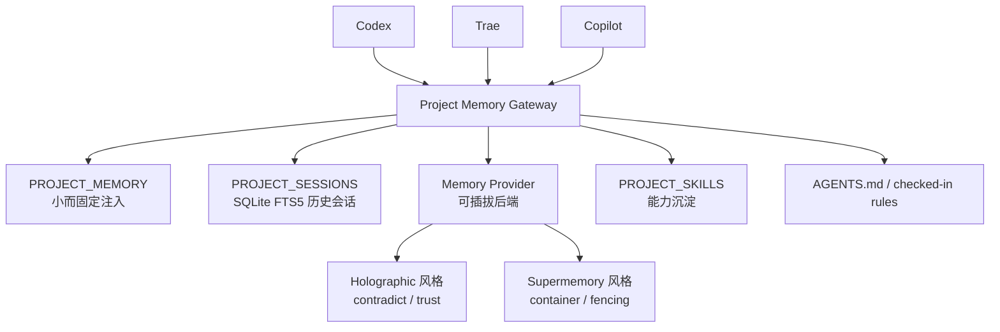
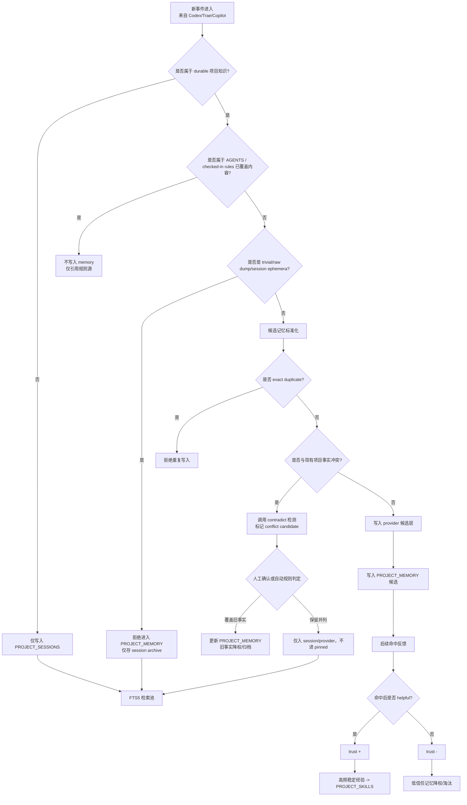
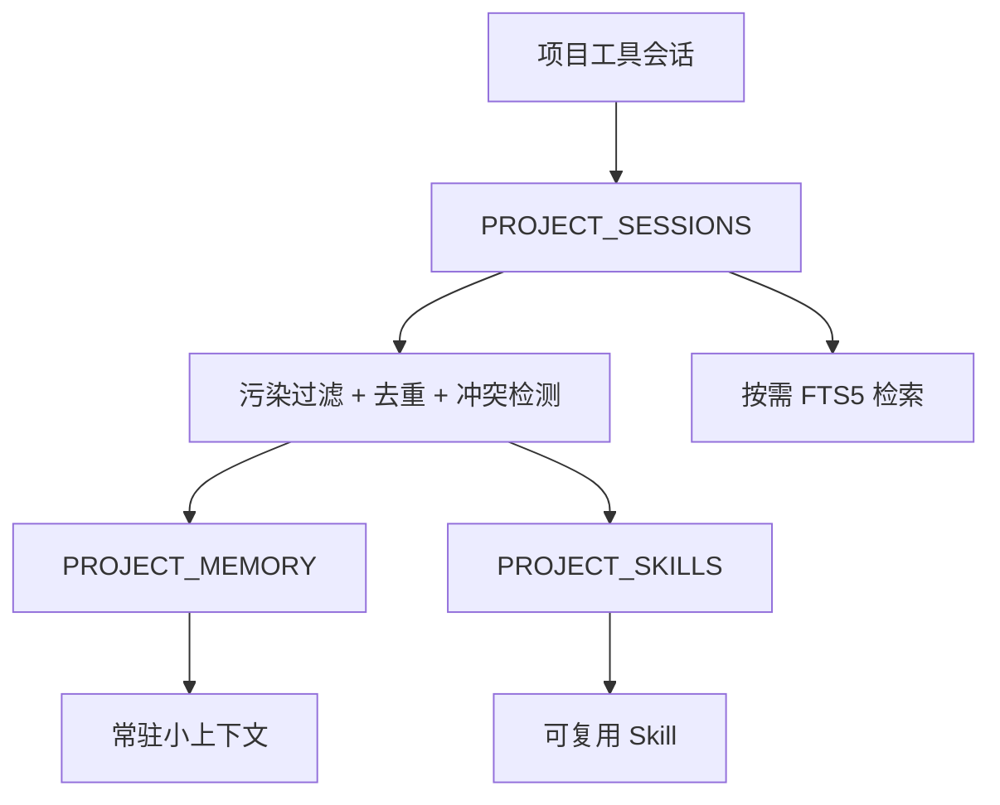

# 《基于 Hermes Agent 的项目级记忆系统裁剪方案》

## 0. 先给结论

你的场景下，**不要把 Hermes 当成现成可直接复用的“跨工具共享记忆总线”**，而要把它当成一套已经验证过核心思路的 **记忆架构母版** 来裁剪：

* **保留**：`bounded memory + session search + memory provider + skills learning loop`
* **删除/弱化**：`USER-centric 建模`、`flat-file 作为最终真相源`、`profile 级隔离作为主边界`
* **改造目标**：从 “Hermes 记住用户” 改成 “项目自己有一份共享记忆”
* **污染控制**：不靠抽象口号，直接借 Hermes 当前已有的两类能力原型：

  * **Holographic** 的 `contradict + trust scoring + feedback`
  * **Supermemory** 的 `context fencing + trivial filtering + multi-container`
    这些能力都已经写进 Hermes 文档，不是空想。([GitHub][1])

同时必须明确：**Hermes 当前内建 flat-file memory 本身还没有真正解决记忆污染**。官方 issue 里已经明确指出，当前系统缺少 contradiction detection、confidence-aware retrieval、automatic extraction、forgetting mechanism；另一个 issue 也明确说明，flat-file memory 没有 scope、importance、categories、timestamps beyond file mtime。([GitHub][2])

---

# 1. 要保留的 Hermes 模块

## 1.1 保留 `bounded memory`

Hermes 当前的内建持久记忆由 `MEMORY.md` 和 `USER.md` 构成，文档明确写了两者是 **有界、精选、跨会话持久** 的记忆，并且在 session 启动时作为冻结快照注入 system prompt。默认上限分别是：

* `MEMORY.md`: 2200 字符，约 800 tokens
* `USER.md`: 1375 字符，约 500 tokens

这套设计的价值非常明确：**把常驻上下文限制在一个小而固定的预算内**，避免无上限膨胀。Hermes 文档还明确规定，当容量接近上限时，应优先 consolidate 或 replace，而不是继续堆积。([赫尔墨斯代理][3])

### 你这里怎么保留

不再保留 `MEMORY.md + USER.md` 这两个“按人组织”的名字，而改成：

* `PROJECT_MEMORY`
* 可选的 `PROJECT_PROFILE`（不是必须）

其中 **真正常驻注入的只有 `PROJECT_MEMORY`**。

### 为什么保留这一层

因为这是 Hermes 已经验证过、且最直接解决“上下文膨胀第一层问题”的部分：
**常驻内容必须小、固定、密度高。** ([赫尔墨斯代理][3])

---

## 1.2 保留 `session_search`

Hermes 文档明确说明，除了 `MEMORY.md/USER.md` 之外，agent 还能通过 `session_search` 搜索过去会话；所有 CLI 和消息平台 session 会被存入 `~/.hermes/state.db`，使用 SQLite + FTS5，全局检索后再做 summarization。开发文档也明确写了 Hermes 的 session persistence 是 **SQLite-based session storage with FTS5 full-text search**。([赫尔墨斯代理][3])

### 你这里怎么保留

把它裁剪成：

* `PROJECT_SESSIONS`
* 所有来自 Codex / Trae / Copilot 的项目会话都进同一个项目 session archive
* **只按需召回，不常驻注入**

### 为什么保留这一层

因为 Hermes 已经用这层把“无限历史”从“常驻上下文”里剥离出来了。
这是当前最值得直接继承的部分之一。([赫尔墨斯代理][3])

---

## 1.3 保留 `memory provider abstraction`

Hermes 文档明确说明 memory providers 是 provider plugin 的一种，**同一时刻只能有一个外部 memory provider 激活**，但 built-in memory 始终同时存在；provider 激活后，Hermes 会自动做 6 件事：

1. 把 provider context 注入 system prompt
2. 每轮前预取相关记忆
3. 每轮后同步 conversation turns
4. session 结束时做 extraction（如果 provider 支持）
5. built-in memory 写入镜像到 provider
6. 增加 provider-specific tools ([赫尔墨斯代理][4])

### 你这里怎么保留

保留“provider 是可插拔后端”这个抽象，但把使用方式从：

* **以用户为中心**

改成：

* **以项目 container / workspace 为中心**

也就是：
同一个项目 A 的 Codex / Trae / Copilot，都写到同一个 provider 容器里。

### 为什么保留这一层

因为你现在不是要研究“如何做一个记忆算法”，而是要尽快有一个 **可切后端、可切工具、可演进** 的骨架。Hermes 这层抽象已经成熟。([赫尔墨斯代理][4])

---

## 1.4 保留 `skills learning loop`

Hermes README 公开把自己的核心能力定义为：
**从经验创建 skills、在使用中改进 skills、促使自己持久化知识、搜索过去会话、并持续加深对用户/上下文的模型。** ([GitHub][1])

### 你这里怎么保留

把 skill 的“人设/个性”部分弱化，保留 **项目 procedure / troubleshooting / workflow 模板** 这类能力化沉淀。

也就是把：

* “用户记忆”

进一步升级成：

* “项目技能资产”

### 为什么保留这一层

因为只做 recall，系统会越来越像“历史垃圾堆”；
只有把高频、高确定性的经验升级成 skill，记忆系统才会产生复利。这个方向本身就是 Hermes 的强项。([GitHub][1])

---

# 2. 要删掉或弱化的 Hermes 模块

## 2.1 弱化 `USER.md / 用户建模` 作为主轴

Hermes 当前内建 memory 的两大 target 分别是：

* `memory`: 环境、工作流、经验
* `user`: 用户身份、偏好、沟通风格等

文档明确写了 `USER.md` 更适合记名字、角色、时区、沟通偏好、workflow habits、technical skill level。([赫尔墨斯代理][3])

### 你的场景为什么要弱化

你已经明确说了：

* 不太关心“使用者是谁”
* 只关心同一项目在多个工具之间共享记忆

所以这里的裁剪原则很简单：

> **把“用户维度”降为可选，不再做主索引。**

### 裁剪结果

* 不再以 `user_id/profile` 做主作用域
* 主作用域改成 `project_key`
* `tool_name/account_alias` 只作为附加元数据

---

## 2.2 删除 `flat-file 作为最终真相源`

这点必须非常坚决。

Hermes 当前内建 memory 仍然是 flat files；但 Hermes 自己在 issue #674 里已经明确提出要把 `MEMORY.md/USER.md` 迁移到 SQLite-backed storage，并说明当前 flat-file 的问题包括：

* 没有 importance scoring
* 没有 scoping
* 没有 categories
* 没有 timestamps beyond file modification time ([GitHub][5])

另外，issue #509 更直接指出，当前系统没有：

* contradiction detection
* confidence-aware retrieval
* automatic extraction
* forgetting mechanism ([GitHub][2])

### 你的裁剪原则

保留“bounded curated memory”这个逻辑层，**但不保留 flat-file 作为最终存储层**。

### 裁剪结果

* 对外可继续渲染为 Markdown / compact text
* 对内直接存为结构化 rows
* `PROJECT_MEMORY` 是逻辑概念，不是必须真落成一个单文件

---

## 2.3 弱化 `profile isolation` 作为主隔离模型

Hermes 文档里对 provider 的默认隔离是 **per-profile**。文档写得很清楚：不同 provider 的数据会按 profile 隔离，本地 provider 通过不同 `$HERMES_HOME` 路径隔离，配置型 provider 通过不同配置隔离，云 provider 会自动衍生 profile-scoped project names。([赫尔墨斯代理][4])

### 为什么你这里不能照搬

因为你现在要的是：

* **项目 A 内跨工具共享**
* 而不是“同一个 Hermes profile 自己隔离得多干净”

而且 Hermes 现有 issue #6320 还表明，当前 session search 和 memory 在多实例/多 profile 场景下出现泄漏问题。也就是说，**就算按 profile 隔离，当前实现也不是你要的那种可靠项目边界。** ([GitHub][6])

### 裁剪结果

* 不以 `profile` 做主隔离
* 只认 `project_key`
* profile 只当运行时实现细节，不当业务边界

---

## 2.4 不把 Hermes MCP 现状当现成共享总线

这点也要说透。

Hermes 自己的 issue #10835 明确写了：
`hermes mcp serve` 当前暴露了 10 个 conversation/messaging tools，但 **zero memory tools**；在和 Claude Code、Cursor 等 MCP client 共存时，目前没有 way to share persistent memory，现实做法仍然是 manual copy/paste。([GitHub][7])

### 这意味着什么

意味着你不能直接说：

> “Hermes 已经能当跨工具记忆服务了”

这个判断目前不成立。
现在能借的是 **architecture**，不是现成成品。

---

# 3. 项目级记忆最小模块边界

这里我不再给“大而全中台”，只给你一个 **最小可落地边界**。

## 3.1 最小模块图



---

## 3.2 模块一：`Project Memory Gateway`

### 职责

这是唯一需要对 Codex / Trae / Copilot 暴露的入口层。

负责：

* 解析 `project_key`
* 统一写入会话事件
* 执行 recall
* 把 `PROJECT_MEMORY`、`PROJECT_SESSIONS`、provider recall、skills 汇总成一个 context bundle
* 在规则冲突时强制 `AGENTS.md` 优先

### 为什么必须有这一层

因为 Hermes 当前并没有直接把 memory 暴露给 MCP 客户端；而你又要跨多个工具共享，所以中间必须有个统一入口。这个判断是基于 Hermes 当前 MCP memory 能力空缺得出的工程结论。([GitHub][7])

---

## 3.3 模块二：`PROJECT_MEMORY`

### 定义

项目级 pinned memory，常驻注入，但必须小。

### 内容范围

只允许进这些内容：

* environment facts
* project conventions
* corrections
* completed work
* skills and techniques that worked

这几类正好与 Hermes 文档推荐保存的内容一致；文档同时明确要求跳过 trivial info、raw dumps、session-specific ephemera，以及已经在 `SOUL.md/AGENTS.md` 中的内容。([赫尔墨斯代理][3])

### 你这里的裁剪规则

把 Hermes 的这套“Save These / Skip These”直接迁移为项目版：

#### 允许进入 `PROJECT_MEMORY`

* 项目事实
* 项目约定
* 经验证的坑点
* 有复用价值的 procedure
* 已完成的重要变更结论

#### 禁止进入 `PROJECT_MEMORY`

* 临时调试上下文
* 一次性日志
* 大段原始输出
* 规则文件已有内容
* 纯会话噪声

---

## 3.4 模块三：`PROJECT_SESSIONS`

### 定义

项目的历史会话档案层。

### 存储形式

直接沿用 Hermes 已验证的思路：

* SQLite
* FTS5
* 只存消息文本/摘要，不做“所有原始上下文都常驻”

Hermes 已经证明 “bounded memory + session_search” 是合理分层。([赫尔墨斯代理][3])

### 这里要特别加一条约束

**不要照搬 Hermes 当前 JSON session file 永久增长的问题。**

Hermes 的 issue #3015 公开指出，session JSON files never deleted，导致：

* hundreds/thousands of accumulated session files
* unbounded disk usage
* exacerbated token costs
* 22M+ tokens burned in ~2 hours 的案例

这说明：
**要学它的 SQLite/FTS5 设计，不要学它那条无清理的 session 文件副本链路。** ([GitHub][8])

---

## 3.5 模块四：`Memory Provider`

### 定义

污染控制和深层 recall 的增强层。

### 推荐裁剪方式

MVP 不做“所有 provider 都支持”，只抽象出一个接口，但优先对齐两类能力：

#### A. Holographic 风格

Hermes 文档写得非常明确，这个 provider 具备：

* local SQLite
* FTS5
* trust scoring
* `fact_store` 工具
* `fact_feedback`
* `contradict` 自动检测 conflicting facts ([赫尔墨斯代理][4])

#### B. Supermemory 风格

Hermes 文档明确写了它具备：

* `container_tag`
* `auto_recall`
* `auto_capture`
* `search_mode=hybrid`
* trivial message filtering
* automatic context fencing
* multi-container mode 和 `custom_containers` 示例，如 `project-alpha` / `shared-knowledge` ([赫尔墨斯代理][4])

### 这层在你的场景中的作用

* `Holographic` 负责 **质量控制**
* `Supermemory` 负责 **项目容器化共享**

---

## 3.6 模块五：`PROJECT_SKILLS`

### 定义

项目级经验的能力化沉淀层。

### 进入条件

仅提升这些类型：

* 已经复用 2~3 次以上的问题排查步骤
* 稳定、不常变的流程
* 多工具都会命中的经验
* 一段 session archive 已被验证为“以后还会再用”

### 为什么必须有这一层

因为 Hermes 自己的价值主张就是 learning loop：
**经验 -> skill -> 使用中改进 -> 再沉淀。** 如果只保留 memory，不保留 skill，这条闭环就断了。([GitHub][1])

---

# 4. 记忆污染控制：具体流程图

这部分我只写 **Hermes 现有能力已能支撑的流程**，不再写无依据的抽象方法。

## 4.1 污染来源拆解

你的场景里，主要有 4 种污染：

1. **噪声污染**
   trivial / raw dump / one-off debugging context 进入 pinned memory

2. **递归污染**
   recall 出来的内容又被 capture 回 memory

3. **矛盾污染**
   新旧事实互相冲突，同时长期存在

4. **低质命中污染**
   经常命中但没用、甚至错误的记忆持续占权重

Hermes 当前文档和 provider 能力分别对这 4 种污染给了不同程度的原型支撑。([赫尔墨斯代理][3])

---

## 4.2 裁剪版污染控制流程



---

## 4.3 这个流程分别借了 Hermes 哪些现成能力

### 第一步：`durable vs noise` 过滤

直接借 Hermes 官方 memory hygiene 规则：

* Save: preferences / facts / corrections / conventions / completed work / explicit requests
* Skip: trivial info / rediscoverable facts / raw dumps / session ephemera / AGENTS/SOUL 内容 ([赫尔墨斯代理][3])

### 第二步：exact duplicate 拦截

Hermes built-in memory 已经会拒绝 exact duplicate。([赫尔墨斯代理][3])

### 第三步：递归污染隔离

直接借 Supermemory provider 的 **automatic context fencing**：
文档明确写了，它会 strips recalled memories from captured turns to prevent recursive memory pollution。([赫尔墨斯代理][4])

### 第四步：矛盾检测

直接借 Holographic provider 的 `contradict` 能力。文档明确写了它支持 automated detection of conflicting facts。([赫尔墨斯代理][4])

### 第五步：反馈降权

直接借 Holographic 的 `fact_feedback` 与 trust scoring。文档写明 helpful / unhelpful 反馈会训练 trust scores，且有 asymmetric feedback。([赫尔墨斯代理][4])

---

# 5. 规则与记忆冲突时的优先级

这一条可以直接写死：

```text
AGENTS.md / checked-in instructions > PROJECT_MEMORY > provider recall > PROJECT_SESSIONS
```

原因有两个：

1. Hermes 文档明确把 `AGENTS.md` / `SOUL.md` 内容列为 **不该再存入 memory** 的内容。([赫尔墨斯代理][3])
2. Hermes 当前 built-in memory 仍然缺少 contradiction detection / confidence-aware retrieval / forgetting，因此它不适合压过 checked-in rules。([GitHub][2])

所以你的判断“冲突时以 AGENTS 为准”是成立的，而且和 Hermes 当前设计方向一致。([赫尔墨斯代理][3])

---

# 6. 最后收敛成一版最小落地策略

## 6.1 只保留这三层



---

## 6.2 只做这三条边界

### 边界 1：主作用域只认 `project_key`

不以 user/profile 为主索引。

### 边界 2：常驻记忆必须小

Hermes 已验证这一点是有效的。([赫尔墨斯代理][3])

### 边界 3：历史和技能分开

session archive 是 archive，skill 是 capability，不混存。

---

## 6.3 只优先支持两类 provider 能力

### 第一优先：Holographic 风格

目标：**控制污染**

### 第二优先：Supermemory 风格

目标：**项目级共享容器**

---

# 7. 最终判断

如果完全按你现在的要求来收敛，我的建议是：

> **用 Hermes 的 bounded memory、session search、provider abstraction、skills loop 作为母版；去掉 USER-centric 和 flat-file 终态；把项目作为唯一主作用域；污染控制优先借 Holographic 的 contradict/trust 机制与 Supermemory 的 context fencing/container 机制；规则冲突时一律 AGENTS 优先。** ([GitHub][1])

下一步最合适的是继续细化成 **《项目级记忆系统模块清单 + 状态流转设计》**，我只写：

* 模块接口
* 写入/检索状态流转
* 污染控制状态字段
* 以及 `PROJECT_MEMORY / PROJECT_SESSIONS / PROJECT_SKILLS` 的最小表结构草案。

[1]: https://github.com/nousresearch/hermes-agent "GitHub - NousResearch/hermes-agent: The agent that grows with you · GitHub"
[2]: https://github.com/NousResearch/hermes-agent/issues/509?utm_source=chatgpt.com "Cognitive Memory Operations — LLM-Driven Encoding ..."
[3]: https://hermes-agent.nousresearch.com/docs/user-guide/features/memory "Persistent Memory | Hermes Agent"
[4]: https://hermes-agent.nousresearch.com/docs/user-guide/features/memory-providers "Memory Providers | Hermes Agent"
[5]: https://github.com/NousResearch/hermes-agent/issues/674 "Feature: Memory Storage Migration — Flat Files to SQLite with Scope, Importance & Timestamps · Issue #674 · NousResearch/hermes-agent · GitHub"
[6]: https://github.com/NousResearch/hermes-agent/issues/6320 "Bug: Session/Memory contamination between multiple agent instances · Issue #6320 · NousResearch/hermes-agent · GitHub"
[7]: https://github.com/NousResearch/hermes-agent/issues/10835 "[Feature]: Expose Hermes memory (MEMORY.md/USER.md) via MCP server · Issue #10835 · NousResearch/hermes-agent · GitHub"
[8]: https://github.com/NousResearch/hermes-agent/issues/3015?utm_source=chatgpt.com "JSON sessions never deleted, causing unbounded disk ..."
