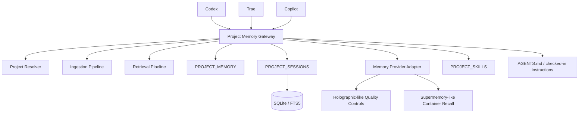
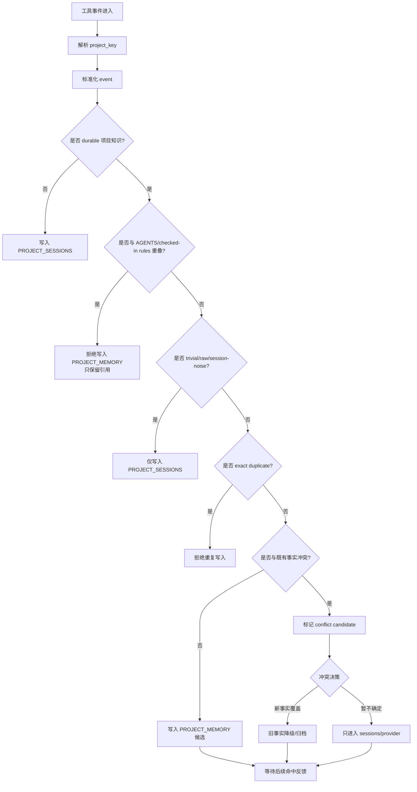
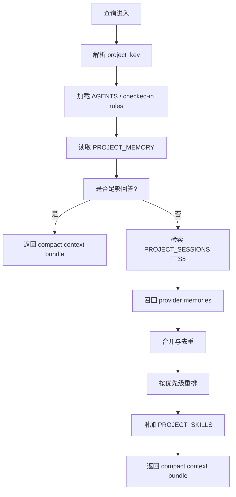

# 《项目级记忆系统模块清单 + 状态流转设计》

## 1. 文档定位

这版只做四件事：

1. **模块清单**
2. **写入 / 检索状态流转**
3. **污染控制状态字段**
4. **最小表结构草案**

设计基线直接取自 Hermes 当前已公开、已落地的能力：**bounded memory、SQLite + FTS5 的 session storage / session search、external memory provider abstraction、skills learning loop**；同时显式避开 Hermes 当前自己也已经暴露出来的问题：**flat-file memory 的结构化能力不足、矛盾记忆未解决、memory tools 尚未通过 MCP 暴露、以及部分 session 持久化路径的膨胀问题。** ([赫尔墨斯代理][1])

---

## 2. 设计总则

### 2.1 主边界

这个系统只认 **`project_key`**，不以 user/profile 作为主隔离边界。原因很直接：你的目标是“项目 A 内跨 Codex / Trae / Copilot 共享记忆”，而 Hermes 当前官方文档虽然强调 profile 级隔离，但公开 issue 也已经出现了多实例/多 profile 下的 session search 与 memory 泄漏问题，因此不能把 profile 当作你这里的业务真边界。 ([赫尔墨斯代理][2])

### 2.2 三层记忆

项目级记忆只保留三层：

* **`PROJECT_MEMORY`**：小而固定、常驻注入
* **`PROJECT_SESSIONS`**：历史会话档案，按需检索
* **`PROJECT_SKILLS`**：从高频经验中提炼出来的能力资产

这正是对 Hermes 已有分层的项目化裁剪：Hermes 的 built-in persistent memory 是 bounded curated memory，session history 走 SQLite/FTS5 的 `session_search`，而外部 providers 与 skills 则承担更深层的 recall 与能力沉淀。 ([赫尔墨斯代理][1])

### 2.3 规则优先级

规则冲突时，固定采用这条优先级：

```text id="7db3s6"
AGENTS.md / checked-in instructions > PROJECT_MEMORY > provider recall > PROJECT_SESSIONS
```

这样定是有根据的：Hermes 官方文档明确把已经存在于 `AGENTS.md` / `SOUL.md` 等 context files 中的内容列为 **不应再次写入 memory** 的内容；与此同时，Hermes 当前内建 memory 仍然缺少 contradiction detection、confidence-aware retrieval 和 forgetting mechanism，因此它不应压过 checked-in rules。 ([赫尔墨斯代理][1])

---

## 3. 模块清单

## 3.1 总体模块图



这个边界和 Hermes 现有架构是对齐的：Hermes 有统一 agent loop、prompt assembly、SQLite session storage、provider runtime resolution，以及 built-in memory + external provider 并存的模型。你这里做的不是推翻，而是把它裁剪成“项目级中间层”。 ([赫尔墨斯代理][3])

---

## 3.2 模块 1：`Project Resolver`

### 职责

把不同工具侧传来的上下文统一映射为同一个 `project_key`。这一层是整个系统的入口锚点。没有它，跨工具共享就会退化成“不同客户端各记各的”。这个要求来自你的业务目标，而 Hermes 当前公开文档中 profile/per-provider 的组织方式并不能直接满足“跨 Codex / Trae / Copilot 的项目级共享”。 ([赫尔墨斯代理][2])

### 输入

* repo identity
* workspace/container name
* optional branch / monorepo namespace
* tool name

### 输出

* `project_key`
* `project_scope_metadata`

### 逻辑约束

`project_key` 一旦解析完成，后续所有写入、检索、技能提升、污染控制都必须先挂到这个键上，再做其他动作。否则项目 A / 项目 B 隔离就没有强约束。这个设计是对 Hermes 当前 profile leakage issue 的反向修正。 ([GitHub][4])

---

## 3.3 模块 2：`Ingestion Pipeline`

### 职责

统一接收来自不同工具的会话摘要、命令结果、人工记忆、候选经验，并将其分类送往 `PROJECT_SESSIONS` 或 `PROJECT_MEMORY`。Hermes 的 built-in memory 文档已经给出了“什么该存、什么不该存”的明确准则，因此这层并不是凭空设计，而是把 Hermes 的 memory hygiene 规则固化成项目版入口闸门。 ([赫尔墨斯代理][1])

### 子步骤

* 事件归一化
* durable / transient 判定
* 规则源冲突检查
* 去重检查
* 冲突检查
* 候选写入
* 后续反馈更新

### 设计原则

所有未经筛选的原始上下文，一律先进入 session archive，而不是直接进入 pinned memory。Hermes 官方文档明确建议 memory 只保留关键事实、约定、修正、完成工作和可复用经验，而 raw dumps、session ephemera、trivial info 都应该跳过。 ([赫尔墨斯代理][1])

---

## 3.4 模块 3：`PROJECT_MEMORY`

### 职责

保存项目级 **小而固定、密度高、常驻注入** 的记忆。它对应 Hermes 的 bounded curated memory，但从“用户/代理视角”改成“项目视角”。Hermes 明确给出了 built-in memory 的容量和“满了之后要 consolidate/replace”的操作哲学，因此这层必须保持极小预算，而不是演变为第二个知识库。 ([赫尔墨斯代理][1])

### 允许进入的内容

* 项目事实
* 项目约定
* 已验证坑点
* 经证明有效的 procedure
* 重要完成事项的结论

### 禁止进入的内容

* 临时调试片段
* 原始日志转储
* 一次性会话噪声
* 已在 `AGENTS.md` / checked-in instructions 中声明的规则
* 未验证的猜测

---

## 3.5 模块 4：`PROJECT_SESSIONS`

### 职责

作为项目历史档案层，保存多工具、多会话的原始对话与摘要，用于按需 recall。Hermes 当前公开的 session storage 和 `session_search` 已经证明 SQLite + FTS5 是一个够轻、够直接、适合 CLI / gateway 场景的实现路径。 ([赫尔墨斯代理][5])

### 设计要求

* **默认全量进档，不常驻注入**
* **支持 FTS5 检索**
* **返回 session-level summaries，而不是把整段原文重新塞回上下文**

Hermes 的 `session_search` 当前就是先用 FTS5 找相关消息，再按 session 分组、截取相关片段、做 focused summaries，然后返回结果。这条链路非常适合你直接继承。 ([赫尔墨斯代理][6])

### 额外约束

不要复制 Hermes 已暴露问题的那条“JSON session files 永不清理”的路径。公开 issue 已经指出，这会导致无界磁盘增长和 token 成本爆炸，因此你的实现应只保留结构化 session archive，不要再叠一套长期不清理的原始文件副本。 ([GitHub][7])

---

## 3.6 模块 5：`Memory Provider Adapter`

### 职责

承接“高级 recall + 质量控制”能力，而不是承接主业务边界。Hermes 的 memory providers 文档明确表明：外部 provider 会在会话前注入 context、会话中同步、会话后提取，并与 built-in memory 并存。这个抽象层本身值得保留。 ([赫尔墨斯代理][2])

### 你这里优先对齐的两种能力

#### A. Holographic-like

重点借：

* conflicting facts 检测
* trust scoring
* helpful/unhelpful feedback

这些能力都已经出现在 Hermes 官方的 provider 对比说明里。 ([赫尔墨斯代理][2])

#### B. Supermemory-like

重点借：

* `container_tag`
* `custom_containers`
* `auto_recall`
* trivial filtering
* context fencing

Hermes 文档明确把它描述为支持 multi-container 和 automatic context fencing，这正适合项目 A / 项目 B 的容器化边界，以及“召回内容不再被捕获回写”的递归污染控制。 ([赫尔墨斯代理][2])

---

## 3.7 模块 6：`PROJECT_SKILLS`

### 职责

把高频、稳定、跨工具可复用的经验，从 recall 材料升级成 skill。Hermes 官方 README 把 “create skills from experience / improve them with use” 作为核心能力之一，因此这不是额外装饰，而是整个记忆系统避免退化成“历史垃圾堆”的关键环节。 ([赫尔墨斯代理][1])

### 进入门槛

* 同类问题多次出现
* 多次命中且有正反馈
* 项目内稳定、不频繁变化
* 能抽象成一组步骤或判断标准

---

# 4. 写入状态流转

## 4.1 流程图



这个流程图本质上是把 Hermes 文档里的 memory hygiene、duplicate prevention、安全扫描思路，以及 provider 文档里的 contradiction / feedback / fencing 能力，压成一个项目版写入流水线。Hermes 当前已经明确支持 exact duplicate 拒绝和 memory security scanning，而更高阶的冲突与反馈则出现在外部 provider 能力矩阵中。 ([赫尔墨斯代理][1])

---

## 4.2 状态定义

### `raw`

原始事件刚进入系统，尚未分类。

### `session_only`

已判定为只进入 `PROJECT_SESSIONS`，不具备 pinned 资格。

### `memory_candidate`

已通过 durable 检查，具备进入 `PROJECT_MEMORY` 的资格。

### `conflict_candidate`

与现有项目事实存在冲突，等待冲突处理。

### `pinned_active`

已进入 `PROJECT_MEMORY`，参与常驻注入。

### `degraded`

曾经有效，但因新事实覆盖、负反馈或过时被降级。

### `promoted_to_skill`

已不再只是记忆，而是进入 `PROJECT_SKILLS`。

这组状态是为了解决 Hermes 公开 issue 所指出的缺口：当前 flat-file memory 缺少 scope、importance、timestamps、contradiction handling 和 forgetting mechanism。你这里不需要一次做完整 cognition system，但至少要让状态机显式表达“候选、冲突、激活、降级、升 skill”这些阶段。 ([GitHub][8])

---

# 5. 检索状态流转

## 5.1 流程图



Hermes 的 `session_search` 已经验证了“按需检索 -> 按 session 聚合 -> focused summary -> 回答”这条路径；而 built-in memory 文档也明确区分了 memory 与 session search 的职责：前者是固定预算、关键事实，后者是无限历史、按需 recall。你的裁剪版只是再加上 `AGENTS` 优先和 skills 后置推荐。 ([赫尔墨斯代理][6])

---

## 5.2 检索输出格式

检索层不应该返回“原始记忆大拼盘”，而应返回一个 **context bundle**，建议固定四段：

1. **规则源摘要**
2. **项目固定记忆摘要**
3. **相关历史会话摘要**
4. **推荐 skills**

这样做的原因和 Hermes 的 bounded memory 思路一致：上下文预算必须被管理，而不是把 archive 直接灌进模型。Hermes 官方文档对 built-in memory 的有界预算和 session search 的按需 summarization 都已经说明了这一点。 ([赫尔墨斯代理][1])

---

# 6. 污染控制状态字段

这是这版最关键的落地部分。你前面提到“不能只提方法，不验证”，所以这里我只保留那些能和 Hermes 当前文档/issue/provider 能力直接对上的字段。

## 6.1 `memory_items` 的核心质量字段

### `durability_level`

表示这条内容的持久性等级。

建议值：

* `transient`
* `session_relevant`
* `project_durable`
* `skill_candidate`

它对应 Hermes 的“save vs skip”原则：trivial info、session ephemera 不应进入常驻记忆，而项目事实、约定、修正、可复用经验才适合保存。 ([赫尔墨斯代理][1])

### `trust_score`

表示这条记忆当前的可信度或命中价值。

它不是 Hermes built-in 当前已有字段，但 Hermes 文档中的 Holographic provider 明确列出了 trust scoring 与 feedback 机制，因此这个字段是有公开能力原型支撑的。 ([赫尔墨斯代理][2])

### `feedback_positive_count` / `feedback_negative_count`

记录命中后正负反馈累计次数。

这同样直接对应 Holographic provider 的 helpful / unhelpful feedback 模型。 ([赫尔墨斯代理][2])

### `conflict_state`

建议值：

* `none`
* `suspected`
* `confirmed`
* `superseded`

这样做是因为 Hermes 当前 built-in memory 缺乏 contradiction detection，但 provider 文档已经有 conflicting facts detection 的能力原型；你这里需要把它做成显式状态，而不是只在检索时临时判断。 ([GitHub][9])

### `rule_overlap_state`

建议值：

* `none`
* `overlaps_agents`
* `overlaps_checked_in_instruction`

这个字段是为“规则与记忆分离”服务的。Hermes 文档已经明确表示 AGENTS / SOUL 里的内容不该重复进 memory，所以 overlap 必须可见。 ([赫尔墨斯代理][1])

### `recall_capture_guard`

布尔或枚举字段，用于标记该条内容是否来自 recall，因此不可再次作为 capture 源回写。

这对应 Supermemory provider 文档里明确写出的 **context fencing** 能力：剥离已召回记忆，避免递归污染。 ([赫尔墨斯代理][2])

### `last_verified_at`

最近一次被验证为“仍然有效”的时间。

Hermes 当前 built-in memory 的问题之一就是缺乏结构化 timestamps 与 forgetting/aging 能力，因此这类字段必须显式加上。 ([GitHub][8])

### `promotion_state`

建议值：

* `none`
* `candidate`
* `accepted`
* `promoted`
* `retired`

对应 memory -> skill 的演化轨迹。Hermes 官方 README 已把 skill creation / improvement 作为核心方向，因此 promotion 不是可有可无的附属字段。 ([赫尔墨斯代理][1])

---

# 7. 最小表结构草案

这里不写 SQL，只写逻辑表。

## 7.1 `projects`

### 作用

定义项目级主作用域。

### 最小字段

* `project_key`
* `display_name`
* `repo_identity`
* `namespace`
* `status`
* `created_at`
* `updated_at`

这是整个系统的最上层锚点；由于你不以 user/profile 为主边界，所以几乎所有核心表都要先挂到 `project_key`。这个选择是对 Hermes 当前 profile-based 默认隔离和已暴露 leakage issue 的针对性调整。 ([赫尔墨斯代理][2])

---

## 7.2 `project_sessions`

### 作用

记录会话元数据。

### 最小字段

* `session_id`
* `project_key`
* `source_tool`
* `source_channel`
* `parent_session_id`
* `started_at`
* `ended_at`
* `message_count`
* `input_tokens`
* `output_tokens`
* `status`

Hermes 的 session storage 文档已经说明了 sessions 表的大致元数据方向：source、user_id、model、parent_session_id、token counts、started/ended 等；你这里直接继承 session lineage、source tagging 和 token 统计思路即可。 ([赫尔墨斯代理][5])

---

## 7.3 `project_messages`

### 作用

保存会话中的消息与关键事件。

### 最小字段

* `message_id`
* `session_id`
* `project_key`
* `role_or_event_type`
* `content`
* `normalized_summary`
* `created_at`
* `capture_eligible`
* `recalled_from_memory`

Hermes 的 session search 是基于 full message history + FTS5 来做的，因此消息级明细表是必须的；而 `recalled_from_memory` 之类字段则是为了实现 context fencing，避免 recall 再 capture。 ([赫尔墨斯代理][5])

---

## 7.4 `memory_items`

### 作用

保存项目级长期记忆。

### 最小字段

* `memory_id`
* `project_key`
* `memory_type`
* `title`
* `summary`
* `content`
* `source_kind`
* `source_session_id`
* `source_message_id`
* `state`
* `durability_level`
* `trust_score`
* `feedback_positive_count`
* `feedback_negative_count`
* `conflict_state`
* `rule_overlap_state`
* `recall_capture_guard`
* `last_verified_at`
* `created_at`
* `updated_at`

这张表本质上就是对 Hermes 当前 flat-file 缺口的直接补位：scope、quality、conflict、feedback、timestamps、promotion readiness 都需要结构化表达。Hermes 自己关于从 flat files 迁到 SQLite with scope / importance / timestamps 的 issue，也从侧面说明这类表结构方向是正确的。 ([GitHub][8])

---

## 7.5 `memory_edges`

### 作用

表示记忆之间的关系。

### 最小字段

* `edge_id`
* `project_key`
* `from_memory_id`
* `to_memory_id`
* `relation_type`
* `created_at`

### 推荐的 `relation_type`

* `same_issue`
* `supports`
* `contradicts`
* `supersedes`
* `derived_to_skill`

Hermes 当前 built-in memory 无法表达关系，这是公开 issue 已明确指出的缺口；因此即使 MVP 很小，也值得预留一张轻量关系表，而不是把“冲突 / 演化 / skill 来源”全部塞进单条文本。 ([GitHub][9])

---

## 7.6 `skills`

### 作用

保存从记忆提升出来的项目技能。

### 最小字段

* `skill_id`
* `project_key`
* `name`
* `origin_memory_id`
* `summary`
* `status`
* `version`
* `created_at`
* `updated_at`

这张表不是为了做完整 skill 平台，而是为了建立最小闭环：**一条记忆不只是被召回，还能在足够稳定后转化为可直接复用的能力。** 这与 Hermes 官方的 skills learning loop 定位是一致的。 ([赫尔墨斯代理][1])

---

# 8. 最小接口清单

这里只写抽象接口名，不写代码。

## 8.1 Resolver 接口

* `resolve_project(context) -> project_key`
* `get_project_scope(project_key)`

## 8.2 写入接口

* `append_session_event(project_key, event)`
* `append_session_summary(project_key, session_id, summary)`
* `propose_memory(project_key, candidate)`
* `confirm_memory(project_key, memory_id)`
* `record_memory_feedback(project_key, memory_id, feedback)`
* `mark_memory_conflict(project_key, memory_id, related_memory_id)`

这些接口就是把 Hermes 的 built-in memory 操作、session persistence，以及 provider 的 feedback / conflict 原型收拢成项目级 API。 ([赫尔墨斯代理][1])

## 8.3 检索接口

* `search_context(project_key, query, intent)`
* `search_sessions(project_key, query)`
* `get_pinned_memory(project_key)`
* `get_related_skills(project_key, query)`

Hermes 当前的 `session_search` 已经为 `search_sessions` 提供了现成范式，而 `get_pinned_memory` 则对应 built-in memory 注入层。 ([赫尔墨斯代理][6])

## 8.4 Skill 接口

* `promote_memory_to_skill(project_key, memory_id)`
* `list_project_skills(project_key)`
* `retire_skill(project_key, skill_id)`

---

# 9. 一版最小落地顺序

## Phase 1

先做：

* `projects`
* `project_sessions`
* `project_messages`
* `memory_items`
* `search_context`

因为 Hermes 已经证明：**bounded memory + session search** 这两层先跑起来，就已经能显著缓解上下文膨胀和“换会话后丢历史”的问题。 ([赫尔墨斯代理][1])

## Phase 2

再补：

* conflict handling
* feedback / trust
* context fencing guard

因为这是对 Hermes 当前公开短板的直接补强：contradiction、confidence、forgetting/aging 并不是 built-in 现成强项。 ([GitHub][9])

## Phase 3

最后补：

* `skills`
* `memory_edges`

因为这是从“能记住”走向“能复用”的阶段。

---

# 10. 最终收口

这一版最核心的落点，不是“做一个更复杂的记忆系统”，而是：

> **把 Hermes 已验证有效的“bounded memory + SQLite/FTS5 session search + provider abstraction + skills loop”裁剪成项目级版本，同时把 Hermes 当前自己也承认的薄弱点——flat-file 结构不足、memory 冲突处理不足、跨 agent memory 暴露不足——用最少的状态字段和最小的表结构补起来。** ([赫尔墨斯代理][1])

下一步最合适的是继续把这份设计再压成一版 **《MVP 迭代清单 + 优先级路线图》**，直接列：

* 第一阶段先做哪些表和接口
* 哪些能力可以先 mock
* 哪些污染控制必须首批上线
* 哪些可以等到第二阶段。

[1]: https://hermes-agent.nousresearch.com/docs/user-guide/features/memory?utm_source=chatgpt.com "Persistent Memory - Hermes Agent - nous research"
[2]: https://hermes-agent.nousresearch.com/docs/user-guide/features/memory-providers?utm_source=chatgpt.com "Memory Providers | Hermes Agent - nous research"
[3]: https://hermes-agent.nousresearch.com/docs/developer-guide/architecture?utm_source=chatgpt.com "Architecture | Hermes Agent - nous research"
[4]: https://github.com/NousResearch/hermes-agent/issues/6320?utm_source=chatgpt.com "Session/Memory contamination between multiple agent ..."
[5]: https://hermes-agent.nousresearch.com/docs/developer-guide/session-storage?utm_source=chatgpt.com "Session Storage | Hermes Agent"
[6]: https://hermes-agent.nousresearch.com/docs/user-guide/sessions?utm_source=chatgpt.com "Sessions | Hermes Agent - nous research"
[7]: https://github.com/NousResearch/hermes-agent/issues/3015?utm_source=chatgpt.com "JSON sessions never deleted, causing unbounded disk ..."
[8]: https://github.com/NousResearch/hermes-agent/issues/674?utm_source=chatgpt.com "Feature: Memory Storage Migration — Flat Files to SQLite ..."
[9]: https://github.com/NousResearch/hermes-agent/issues/509?utm_source=chatgpt.com "Cognitive Memory Operations — LLM-Driven Encoding ..."
